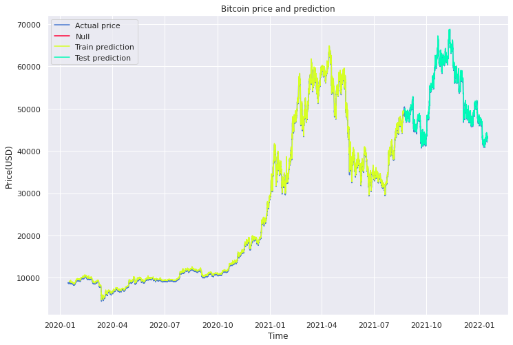
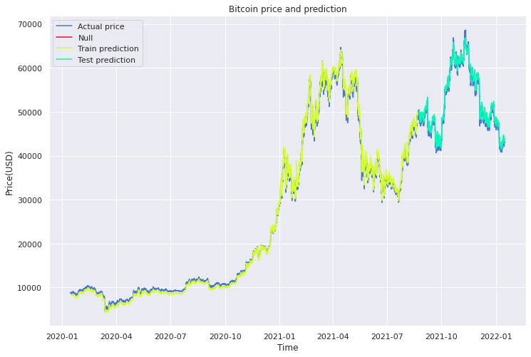
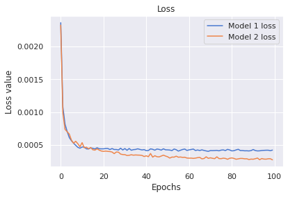

# Bitcoin price prediction using LSTM

> :warning: The price of cryptocurrencies or the stock market is something that is extremely difficult to predict in the future. **This project is only for education purpose, it shouldn't be used to trade on Bitcoin.**

## Data preparation

Retrieve real time data from Yahoo Finance using *yfinance* library since last 2 years and in 1 hour time frame.

```python
btc = yf.Ticker('btc-usd').history(period='2y', interval='1h')
```

## Data preprocessing

The price prediction will be based on the closing price so we will scale the price
in the *Close* column using `MinMaxScaler`. Then divide the data into train and test in the radio 8/2.

Each column of `X` is the closing price consist of `lookback` features and `y` is the closing price of the next session.

## Modeling

There are total 2 models with same **optimizer Adam** and **MSE loss function**. Both of them will be trained with epochs of 100 and batch size of 32. Between each layer, we will add a dropout layer with rate of 0.2.

### First model

First model is a simple LSTM model with 1 LSTM layer contains 50 units and 1 Dense layer for the output.

```python
_________________________________________________________________
 Layer (type)                Output Shape              Param #   
=================================================================
 lstm (LSTM)                 (None, 50)                10400     
                                                                 
 dropout (Dropout)           (None, 50)                0         
                                                                 
 dense (Dense)               (None, 1)                 51        
                                                                 
=================================================================
Total params: 10,451
Trainable params: 10,451
Non-trainable params: 0
```

First model prediction compared to the real price relatively accurate with loss of 4.2315e-04.


### Second model

Second model have two more LSTM layers with 1000 units each and 1 Dense layer for the output.

```python
_________________________________________________________________
 Layer (type)                Output Shape              Param #   
=================================================================
 lstm_1 (LSTM)               (None, 50, 50)            10400     
                                                                 
 dropout_1 (Dropout)         (None, 50, 50)            0         
                                                                 
 lstm_2 (LSTM)               (None, 50, 100)           60400     
                                                                 
 dropout_2 (Dropout)         (None, 50, 100)           0         
                                                                 
 lstm_3 (LSTM)               (None, 100)               80400     
                                                                 
 dropout_3 (Dropout)         (None, 100)               0         
                                                                 
 dense_1 (Dense)             (None, 1)                 101       
                                                                 
=================================================================
Total params: 151,301
Trainable params: 151,301
Non-trainable params: 0
```

After two hours of training the model prediction is quite better with loss of 2.7483e-04.


### Loss comparison

As we can see the second model prediction is more accurate than the first model.

